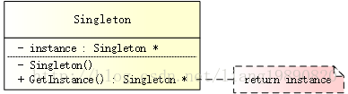

# 1.赋值运算符函数
## 要点：
* 返回值类型为**自身引用**`*this`,这样才可以连续赋值
* 把传入参数的类型声明为**常量引用**，这样可以不调用赋值构造函数，可以不改变输入的参数
* 是否**释放实例自身已有内存**。如果我p们忘记在分配新内存之前释放自身已有空间，则程序将出现**内存泄漏**,本题中有数据成员。指向字符串的指针：char* m_pDat。需要把指针指向的内存释放掉，再给指针声明为空。
* 判断传入的参数和当前的实例(`*this`)是不是同一个实例。如果是同一个，则不进行赋值操作，直接返回。**当this和传入的参数是同一个实例时，一旦释放自身内存，传入的参数的内存也被同时释放，因此再也找不到需要赋值的内容了。**
* 申请内存时可能会内存不足导致new char抛出异常，但是此时已经释放了mpDat指向的内存，并且指针为空，抛出异常时，原来类的实例**不再保持一个有效的状态，违背了异常安全性**。 解决：
> * 方法1.先用new分配新的内容，再delete释放已有内容。
> * 方法2.创建一个临时实例，再交换临时实例和原来的实例
## 记得写测试代码
* 把一个CMyString的实例赋值给另外一个实例
* 把一个CMyString的实例赋值给自己
* 连续赋值

## 代码：
```C++
class CMyString
{
public:
CMyString(char*  m_pData=nullptr);
CMyString(const  CMyString& str);
~CMyString(void);

private:
char* m_pData;
};

//解法1代码：先申请内存，再delete
CMyString& CMyString::operator=(const CMyString& str)
{
if(this==str)
{
char *temp_pData=new char[strlen(str.m_pData)+1)];
delete[]m_pData;
m_pData=temp_pData;
strcpy(m_pData,str.m_pData);
}
return *this;
}

//解法2代码：使用拷贝构造函数
CMyString& CMyString::operator=(const CMyString& str)
{
if(this==str)
{
CMyString strTemp(str);//复制构造函数创建临时对象，临时对象失效时会自动调用析构函数
char* pTemp=strTemp.m_pData;//创建一个指针指向临时对象的数据成员m_pData
strTemp.m_pData=m_pData;//交换
m_pData=pTemp;//交换
}
return *this;
}
```
在解法2代码中，如果用默认的复制构造函数会发生浅拷贝吧？所以应该重新定义复制（拷贝）构造函数吧？像下列一样：但是书上没有提及
```C++
CMyString::CMyString(const CMyString & st)
{
m_pData =new char[std::strlen(st.m_pData)+1];
std::strcpy(m_pData,st.m_pData);
}
```
# 2.实现Singleton模式（单例模式）/要考虑多线程
* 来源1：https://blog.csdn.net/liang19890820/article/details/61615495
* 来源2：https://www.cnblogs.com/zhaoyan001/p/6365064.html

- singleton是设计模式里面的一个问题，**Singleton是唯一一个能够用短短几十行代码完整实现的模式**
- 其目的是使得类的一个对象成为系统中的唯一实例。
- 这种模式涉及到一个单一的类，该类负责创建自己的对象，同时确保只有单个对象被创建。这个类提供了一种访问其唯一对象的方式，可以直接访问，不需要实例化该类的对象。

## 要点：

单例模式的要点有三个：

- 单例类有且仅有一个实例
- 单例类必须自行创建自己的唯一实例
- 单例类必须集合所有其他对象提供这一实例

实现角度：

- 提供一个private构造函数（防止外部调用而构造类的实例），这样外部就无法构造实例
- 提供一个该类的static private对象
- 提供一个static public函数，用于创建或获取其本身的静态私有对象（例如：GenInstance()）**用static修饰成员函数使得不需要生成对象就可以访问该函数，但是在 static 函数内不能访问非静态成员**

关键点：

- 线程安全（双检锁-DCL，即：double-checked locking）
- 资源释放

## UML结构图：



## 使用静态局部变量

```C++
// singleton.h
#ifndef SINGLETON_H
#define SINGLETON_H

// 非真正意义上的单例
class Singleton
{
public:
//静态成员函数以及访问类型为公有的，使得不需要对象也能够在外部调用该函数创建实例 如：Singleton::GetInstance();
    static Singleton& GetInstance()
    {
        static Singleton instance;
        return instance;
    }

private:
    Singleton() {}
};

#endif // SINGLETON_H
```

- 但是，这并非真正意义上的单例。当使用如下方式访问单例时

  > ```c++
  > Singleton single = Singleton::GetInstance();
  > ```

- 这会出现了一个类拷贝问题，从而违背了单例的特性。产生这个问题原因在于：编译器会生成一个默认的拷贝构造函数，来支持类的拷贝。

  为了避免这个问题，有两种解决方式：

  1. 将 GetInstance() 函数的返回类型修改为指针，而非引用。

     ```c++
     // singleton.h
     #ifndef SINGLETON_H
     #define SINGLETON_H
     
     // 单例
     class Singleton
     {
     public:
         // 修改返回类型为指针类型
         static Singleton* GetInstance()
         {
             static Singleton instance;
             return &instance;
         }
     
     private:
         Singleton() {}
     };
     
     #endif // SINGLETON_H
     ```

  2. 显式地声明类的拷贝构造函数，并重载赋值运算符。（个人觉得比较好的方法），**分别显式地声明了，构造函数，拷贝构造函数，和重载赋值运算符,其访问类型为私有，说明只有调用公有类方法来调用它们才能访问这三个函数，使得外部不会通过各种方式创建对象，只能够通过GetInstance()方法创建**

     ```c++
     // singleton.h
     #ifndef SINGLETON_H
     #define SINGLETON_H
     
     #include <iostream>
     
     using namespace std;
     
     // 单例
     class Singleton
     {
     public:
         static Singleton& GetInstance()
         {
             static Singleton instance;
             return instance;
         }
     
         void doSomething() {
             cout << "Do something" << endl;
         }
     
     private:
         Singleton() {}  // 构造函数（被保护）
         Singleton(Singleton const &);  // 无需实现，构造函数拷贝
         Singleton& operator = (const Singleton &);  // 无需实现，赋值运算符
     };
     
     #endif // SINGLETON_H
     
     
     ```

## 懒汉式/饿汉式

```c++
// singleton.h
#ifndef SINGLETON_H
#define SINGLETON_H

// 单例 - 懒汉式/饿汉式公用
class Singleton
{
public:
    static Singleton* GetInstance();

private:
    Singleton() {}  // 构造函数（被保护）

private:
    static Singleton *m_pSingleton;  // 指向单例对象的指针
};

#endif // SINGLETON_H

```

- 懒汉式特点

  1.lazy初始化

  2.非多线程安全

- 优点：第一次调用才初始化，避免内存浪费

- 缺点：必须加锁（在“线程安全”部分分享如何加锁）才能保证单例，但加锁会影响效率。

```c++
// singleton.cpp
#include "singleton.h"

// 单例 - 懒汉式
Singleton *Singleton::m_pSingleton = NULL;

Singleton *Singleton::GetInstance()
{
    if (m_pSingleton == NULL)
        m_pSingleton = new Singleton();

    return m_pSingleton;
}

```

- 饿汉式特点：

  1.非Lazy初始化

  2.多线程安全

- 优点：没有加锁，执行效率会提高。

- 缺点：类加载是就初始化，浪费内存。

```c++
// singleton.cpp
#include "singleton.h"

// 单例 - 饿汉式
Singleton *Singleton::m_pSingleton = new Singleton();

Singleton *Singleton::GetInstance()
{
    return m_pSingleton;
}

```

## 线程安全

- 在懒汉式下，如果使用多线程，会出现线程安全隐患。为了解决这个问题，可以引入双检锁 - DCL 机制。

```c++
// singleton.h
#ifndef SINGLETON_H
#define SINGLETON_H

#include <iostream>
#include <mutex>//互斥器，使多个线程和谐工作。同一时间内，只能有一个线程得到互斥对象，并获得资源操作权限，那么如果同一时间其他线程也想去操作资源，此时就会因为Mutex未处于激发状态，而无奈的等待…
using namespace std;

// 单例 - 懒汉式/饿汉式公用
class Singleton
{
public:
    static Singleton* GetInstance();

private:
    Singleton() {}  // 构造函数（被保护）

private:
    static Singleton *m_pSingleton;  // 指向单例对象的指针
    static mutex m_mutex;  // 锁
};

```

```c++
// singleton.cpp
#include "singleton.h"

// 单例 - 懒汉式（双检锁 DCL 机制）
Singleton *Singleton::m_pSingleton = NULL;
mutex Singleton::m_mutex;

Singleton *Singleton::GetInstance()
{
    if (m_pSingleton == NULL) {
        std::lock_guard<std::mutex> lock(m_mutex);  // 自解锁
        if (m_pSingleton == NULL) {
            m_pSingleton = new Singleton();
        }
    }
    return m_pSingleton;
}
```

- 这样，就可以保证线程安全了，但是，会带来较小的性能影响。

## 资源释放

有内存申请，就要有对应的释放，可以采用下述两种方式：

- 主动释放（手动调用接口来释放资源）
- 自动释放（由程序自己释放）

要手动释放资源，添加一个 static 接口，编写需要释放资源的代码：

```c++
// 单例 - 主动释放
static void DestoryInstance()
{
    if (m_pSingleton != NULL) {
        delete m_pSingleton;
        m_pSingleton = NULL;
    }
}
```

然后在需要释放的时候，手动调用该接口：

```c++
Singleton::GetInstance()->DestoryInstance();
```

方式虽然简单，但很多时候，容易忘记调用 DestoryInstance()。这时，可以采用更方便的方式：

```c++
// singleton.h
#ifndef SINGLETON_H
#define SINGLETON_H

#include <iostream>

using namespace std;

// 单例 - 自动释放
class Singleton
{
public:
    static Singleton* GetInstance();

private:
    Singleton() {}  // 构造函数（被保护）

private:
    static Singleton *m_pSingleton;  // 指向单例对象的指针

    // GC 机制
    class GC
    {
    public:
        ~GC()
        {
            // 可以在这里销毁所有的资源，例如：db 连接、文件句柄等
            if (m_pSingleton != NULL) {
                cout << "Here destroy the m_pSingleton..." << endl;
                delete m_pSingleton;
                m_pSingleton = NULL;
            }
        }
        static GC gc;  // 用于释放单例
    };
};

#endif // SINGLETON_H
```

只需要声明 Singleton::GC 即可：

```c++
// main.cpp
#include "singleton.h"

Singleton::GC Singleton::GC::gc; // 重要

int main()
{
    Singleton *pSingleton1 = Singleton::GetInstance();
    Singleton *pSingleton2 = Singleton::GetInstance();

cout << (pSingleton1 == pSingleton2) << endl;

return 0;
}
```

在程序运行结束时，系统会调用 Singleton 的静态成员 GC 的析构函数，该析构函数会进行资源的释放。这种方式的最大优点就是在“不知不觉”中进行，所以，对我们来说，尤为省心。

# 数组中重复的数字

## 题目：
* 在一个长度为n的数组里的所有数字都在0到n-1的范围内。 数组中某些数字是重复的，但不知道有几个数字是重复的。也不知道每个数字重复几次。请找出数组中**任意一个重复的数字**。 例如，如果输入长度为7的数组{2,3,1,0,2,5,3}，那么对应的输出是第一个重复的数字2。
## 方法0：
* 利用排序: 排序一个长度为n的数组需要**O(nlogn)的时间**。/快速排序，归并排序。
* 利用哈希表: 从头到尾按顺序扫描数组的每个数字，每扫描到一个数字的时候，都可以用O（1）的时间来判断哈希表里是否已经包含了该数字。如果哈希表里没有这个数字，就把它加入哈希表。如果哈希表已经存在该数字，就找到一个重复数字。**这个算法的时间复杂度为O(n)**
## 思路：
* 还可以把当前序列当成是一个下标和下标对应值是相同的数组（**时间复杂度为O(n),空间复杂度为O(1)**）；遍历数组，判断当前位的值和下标是否相等：
* 1.若相等，则遍历下一位；
* 2.若不等，则将当前位置i上的元素和a[i]位置上的元素比较：若它们相等，则找到了第一个相同的元素；若不等，则将它们两交换。换完之后a[i]位置上的值和它的下标是对应的，但i位置上的元素和下标并不一定对应；重复2的操作，直到当前位置i的值也为i，将i向后移一位，再重复2。

## 举例说明：{2,3,1,0,2,5,3}

> * 0(索引值)和2(索引值位置的元素)不相等，并且2(索引值位置的元素)和1(以该索引值位置的元素2为索引值的位置的元素)不相等，则交换位置，数组变为：{1,3,2,0,2,5,3}；
> * 0(索引值)和1(索引值位置的元素)仍然不相等，并且1(索引值位置的元素)和3(以该索引值位置的元素1为索引值的位置的元素)不相等，则交换位置，数组变为：{3,1,2,0,2,5,3}；
> * 0(索引值)和3(索引值位置的元素)仍然不相等，并且3(索引值位置的元素)和0(以该索引值位置的元素3为索引值的位置的元素)不相等，则交换位置，数组变为：{0,1,2,3,2,5,3}；
> * 0(索引值)和0(索引值位置的元素)相等，遍历下一个元素；
> * 1(索引值)和1(索引值位置的元素)相等，遍历下一个元素；
> * 2(索引值)和2(索引值位置的元素)相等，遍历下一个元素；
> * (3(索引值)和3(索引值位置的元素)相等，遍历下一个元素；
> * 4(索引值)和2(索引值位置的元素)不相等，但是2(索引值位置的元素)和2(以该索引值位置的元素2为索引值的位置的元素)相等，则找到了第一个重复的元素。
## 代码：
```C++
#include<iostream>

class Solution {
public:
	// Parameters:
	//        numbers:     an array of integers           //整型数组
	//        length:      the length of array numbers    //数组长度
	//        duplication: (Output) the duplicated number in the array number//输出其中一个副本数字
	// Return value:       true if the input is valid, and there are some duplications in the array number
	//                     otherwise false
	bool duplicate(int numbers[], int length, int* duplication) {
		// 非法输入
		if (numbers == nullptr || length <= 0){
			return false;
		}
		// 非法输入
		for (int i = 0; i < length; i++){
			if (numbers[i] < 0 || numbers[i] > length - 1){
				return false;
			}
		}
		// 遍历查找第一个重复的数
		for (int i = 0; i < length; i++){
			while (numbers[i] != i){
				if (numbers[i] == numbers[numbers[i]]){
					*duplication = numbers[i];
					return true;
				}
				//swap(numbers[i], numbers[numbers[i]]);
				int temp = numbers[i];
				numbers[i] = numbers[temp];
				numbers[temp] = temp;
			}
		}
		return false;
	}
};
int main(){
	Solution s;
	int a[] = {9,1,0,5,6,4,3,2,2,8};
	int dup[10] = {};
	s.duplicate(a, 10, dup);
	for (int i = 0; i < 10; i++)
	{
		std::cout << dup[i] << std::endl;
	}
	getchar();
}
```
