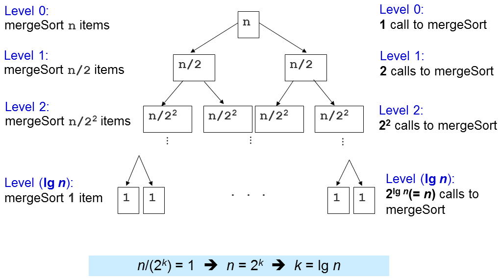

# 排序

排序问题：以一定的顺序对一个数组（或一个列表）中的项进行重新排序（可以进行比较，例如整数，浮点数，字符串等）（增加，非递减，递减， 增加，词典等）。

* 排序问题有许多有趣的算法解决方案，体现了许多**计算机科学的想法**：

1. 比较与非比较策略
2. 迭代与递归实现
3. 分而治之范式
4. 最佳/最差/平均情况时间复杂性分析
5. 随机算法等

*  应用：

1. 在数组 **A** 中搜索特定值 **v**，
2. 查找（静态）数组 **A** 中的最小/最大/第 **k** 个最小/最大值，
3. 测试唯一性并删除数组 **A** 中的重复项，
4. 计算特定值 **v** 在数组 **A** 中出现多少次，
5. 设置数组 **A** 和另一个排序数组 **B** 之间的交集/联合，
6. 寻找一个目标对 **x∈A** 和 **y∈A**，使得 **x + y** 等于目标 **z** 等。

## 排序算法分类

1. 基于比较的排序算法:
   1. BUB - 冒泡排序,
   2. SEL - 选择排序,
   3. INS - 插入排序,
   4. MER - 归并排序 (递归实现),
   5. QUI - 快速排序 (递归实现),
   6. R-Q - 随机快速排序 (递归实现).
2. 不基于比较的排序算法:
   1. COU - 计数排序,
   2. RAD - 基数排序.

## 1.冒泡排序

### 描述：

给定一个N个元素的数组，冒泡法排序将：

1. 如果元素大小关系不正确，交换这两个数（在本例中为a> b），
2. 比较一对相邻元素（a，b），
3. 重复步骤1和2，直到我们到达数组的末尾（最后一对是第（N-2）和（N-1）项，因为我们的数组从零开始）
4. 到目前为止，最大的元素将在最后的位置。 然后我们将N减少1，并重复步骤1，直到N = 1。

### 分析：

比较和交换需要一个以常量为界的时间，我们称之为c。
（标准）Bubble Sort中有两个嵌套循环。
外循环正好运行N次迭代。 但内部循环运行变得越来越短：

1. 当 i = 0，（N-1）次迭代（比较和可能交换）时。
2. 当 i = 1，（N-2）次迭代时，...
3. 当 i =（N-2）时，1次迭代,
4. 当 i=（N-1），0迭代.

因此，总迭代次数=（**N**-1）+（**N**-2）+ ... + 1 + 0 = **N** *（**N**-1）/ 2（[推导](https://en.wikipedia.org/wiki/Arithmetic_progression#Sum)）。
总时间= c * **N** *（**N**-1）/ 2 = O（**N** ^ 2）。

### 评价：

冒泡排序实际上是低效的，它的 **O(N^2)** 时间复杂度。 想象一下，我们有 **N** = 106 个数字。 即使我们的计算机速度超快，并且可以在1秒内计算108次操作，但冒泡排序仍需要大约100秒才能完成。
但是，它可以提前终止，例如， 尝试Bubble Sort上面显示的小型升序示例[3,6,11,25,39]，它在O(**N**)时间结束。
改进的思路很简单：如果我们通过内部循环完全不交换，这意味着数组已经排序，我们可以在这个点上停止冒泡排序。
讨论：虽然它使冒泡排序在一般情况下运行得更快，但这种改进的想法并没有改变冒泡排序的 **O(N^2)** 时间复杂性...为什么？


## 2.选择排序

### 描述：

给定 N个项目和 L = 0的数组，选择排序将：

1. 在 **[L ... N-1]** 范围内找出最小项目 **X** 的位置，
2. 用第 **L** 项交换X，
3. 将下限 **L** 增加1并重复步骤1直到 **L = N-2**。

### 分析评价：

```c++
void selectionSort(int a[], int N) {
  for (int L = 0; L <= N-2; L++) { // O(N)
    int X = min_element(a+L, a+N) - a; // O(N)    swap(a[X], a[L]); // O(1), X 可能和 L 相等(就没有交换)
  }
}
```
复杂度: O(N2) — 实际上，这和冒泡排序很像。


## 3.插入排序

### 描述：

插入排序类似于大多数人安排扑克牌的方式。


1. 从你手中的一张牌开始，
2. 选择下一张卡并将其插入到正确的排序顺序中，
3. 对所有的卡重复上一步。

### 代码与分析：

```C++
void insertionSort(int a[], int N) {
  for (int i = 1; i < N; i++) { // O(N)
    X = a[i]; // X is the item to be inserted
    int j = i-1;
    for (; j >= 0 && a[j] > X; j--) // can be fast or slow
      a[j+1] = a[j]; // make a place for X
    a[j+1] = X; // index j+1 is the insertion point
  }
}
```

外循环执行N-1次，这很明显。

但内循环执行的次数取决于输入：

1. 在最好的情况下，数组已经排序并且（a [j]> X）总是为假所以不需要移位数据，并且内部循环运行在O（1），
2. 在最坏的情况下，数组被反向排序并且（a [j]> X）始终为真插入始终发生在数组的前端，并且内部循环以O（**N**）运行。

因此，最佳情况时间是O(**N × 1**) = O(**N**) ，最坏情况时间是O(**N × N**) = O(**N**2).

## 分界线

我们将在接下来的几张幻灯片中讨论两种（加一半）基于比较的排序算法：

1. 归并排序
2. 快速排序和它的随机版本（只有一个变化）。

这些排序算法通常以递归方式实现，使用分而治之的问题解决范例，并且运行在归并排序和O（N log N）时间的**O（N log N）**时间中，以期望随机快速排序。
PS：尽管如此，快速排序（Quick Sort）的非随机版本在 O(**N2**) 中运行。

## 4.归并排序

### 描述：

给定一个N个项目的数组，归并排序将：

1. 将每对单个元素（默认情况下，已排序）归并为2个元素的有序数组，
2. 将2个元素的每对有序数组归并成4个元素的有序数组，重复这个过程......，
3. 最后一步：归并2个N / 2元素的排序数组（为了简化讨论，我们假设N是偶数）以获得完全排序的N个元素数组。

### 细节：

我们首先讨论归并排序算法的最重要的子程序：O( **N** )归并，然后解析这个归并排序算法。
给定两个大小为 **N1** 和 **N2** 的排序数组 **A** 和 **B**，我们可以在O( **N** ) 时间内将它们有效地归并成一个大小为 **N** = **N1** + **N2**的组合排序数组。
这是通过简单地比较两个阵列的前面并始终取两个中较小的一个来实现的。 但是，这个简单但快速的O( **N** )合并子例程将需要额外的数组来正确地进行合并。 请参阅下一张幻灯片。

### 代码：

```C++
void merge(int a[], int low, int mid, int high) {
  // subarray1 = a[low..mid], subarray2 = a[mid+1..high], both sorted
  int N = high-low+1;
  int b[N]; // 讨论: 为什么我们需要一个临时的数组 b?
  int left = low, right = mid+1, bIdx = 0;
  while (left <= mid && right <= high) // 归并
    b[bIdx++] = (a[left] <= a[right]) ? a[left++] : a[right++];
  while (left <= mid) b[bIdx++] = a[left++]; // leftover, if any
  while (right <= high) b[bIdx++] = a[right++]; // leftover, if any
  for (int k = 0; k < N; k++) a[low+k] = b[k]; // copy back
}

```

在示例数组[1,5,19,20,2,11,15,17]上尝试Merge Sort，其前半部分已经排序[1,5,19,20]，其下半部分也已经排序[2 ，11,15,17]。 专注于合并排序算法的最后一次合并。

### 分而治之的范式

在我们继续之前，让我们先谈谈分而治之（Divide and Conquer，缩写为D＆C），这是一个强大的解决问题的范例。

分而治之算法通过以下步骤解决（某种类型的）问题 - 比如我们的排序问题：

1. 划分步骤：将大的原始问题划分成较小的子问题并递归地解决较小的子问题，
2. 解决步骤：结合较小的子问题的结果来产生较大的原始问题的结果。


**归并并排序是分而治之的排序算法。**
划分步骤很简单：将当前数组分成两半（如果N是偶数，则将其完全平等，或者如果N是奇数，则一边稍大于一个元素），然后递归地对这两半进行排序。
解决步骤是最有效的工作：使用前面讨论的

归并子例程合并两个（排序的）半部分以形成一个有序数组。

### 代码：

```C++

void mergeSort(int a[], int low, int high) {
  // 要排序的数组是 a[low..high]
  if (low < high) { // base case: low >= high (0 or 1 item)
    int mid = (low+high) / 2;	
    mergeSort(a, low  , mid ); // 分成一半
    mergeSort(a, mid+1, high); // 递归地将它们排序
    merge(a, low, mid, high); // 解决: 归并子程序
  }
}
```

请在示例数组 [7, 2, 6, 3, 8, 4, 5] 上尝试Merge Sort以查看更多详细信息。
与许多其他CS打印的教科书通常显示的一样（因为教科书是静态的），合并排序的实际执行不会一层一层地分成两个子数组，但是它会在处理正确的子数组之前递归地排序左边的子数组。
就是这样，在示例数组{7,2,6,3,8,4,5}上，它将缓存到{7,2,6,3}，然后是{7,2}，然后是{7}（单个 元素，默认排序），回溯，递归到{2}（排序），回溯，然后在继续处理{6,3}等等之前，最终将{7,2}合并到{2,7}中。

### 分析：

在归并排序中，大部分工作是在解决/归并的步骤中完成的，因为分解步骤并没有真正执行任何操作（视为O（1））。
当我们称之为归并的（a，低，中，高）时候，我们处理**k =（高 - 低+ 1）**项。 最多会有 **k-1** 个比较。 从原始数组 **a** 到临时数组 **b** 有 **k** 个移动，而另一个 **k** 移回。 总的来说，归并子例程内的操作次数 <3**k**-1 = O（**k**）。
重要的问题是这个归并子程序被调用了多少次？



级别1：2 ^ 0 = 1调用merge( ) 和 N / 2 ^ 1个项目，O（2 ^ 0 x 2 x N / 2 ^ 1）= O（N）级别2：2 ^ 1 = 2调用 merge( ) 与N / 2 ^ 2个项目，O（2 ^ 1 x 2 x N / 2 ^ 2）= O（N）级别3：2 ^ 2 = 4调用merge( ) 与N / 2 ^ O（2 ^ 2 x 2 x N / 2 ^ 3）= O（N）...级别（log N）：2 ^（log N-1）（或N / 2）调用merge( ) ），其中N / 2 ^ log N（或1）个项目，O（N）

有 log(N) 个日志级别，每个级别都执行O（N）工作，因此总体时间复杂度为O（N log N）。 稍后我们会看到这是一种最佳（基于比较）的排序算法，即我们无法做得比这更好。

### 优缺点：

无论输入的原始顺序如何，归并排序中最重要的部分是其O（**N** log **N**）性能保证。 就这样，没有任何敌手测试用例可以使归并排序对于任何N个元素数组运行比O（**N** log **N**）更长的时间。
因此，归并排序非常适合分类非常大量的输入，因为O（**N** log **N**）比[前面讨论的](https://visualgo.net/zh/sorting?slide=5)O（**N2**）排序算法增长得慢得多。
归并排序也是一个[稳定的排序](https://visualgo.net/zh/sorting?slide=16-2)算法。 讨论：为什么？
然而，归并排序有几个不太好的部分。 首先，从零开始实施起来并不容易（[但我们不必这样做](https://visualgo.net/zh/sorting?slide=18-2)）。 其次，它在[归并操作](https://visualgo.net/zh/sorting?slide=10-2)期间需要额外的O（**N**）存储，因此不是真正的存储效率和[不到位](https://visualgo.net/zh/sorting?slide=16-1)。顺便说一句，如果你有兴趣看看为解决这些（经典）归并排序不那么好的部分做了什么，你可以阅读[这个](https://en.wikipedia.org/wiki/Merge_sort#Variants)。

## 5.快速排序

快速排序是另一个分而治之排序算法（另一个在这个可视化页面中讨论的是[归并排序](https://visualgo.net/zh/sorting?slide=10)）。
我们将看到，这种确定性的，非随机化的快速排序的版本可能在对手输入中具有O（N2）的很差的时间复杂度，之后再继续[随机化的](https://visualgo.net/zh/sorting?slide=12)和可用的版本。

### 快速排序是分而治之的算法

划分步骤：选择一个项目 **p**（称为枢轴点）然后将 **a[i..j]** 的项目分为三部分：**a [i..m-1]**，**a [m]** 和 **a[m + 1..j]**。 **a [i..m-1]**（可能为空）包含小于 **p** 的项目。 **a [m]** 是枢轴点 **p**，例如：指数 **m** 是已排序数组 **a** 的排序顺序中 p 的正确位置。 **a [m + 1..j]**（可能为空）包含大于或等于 **p** 的项目。 然后，递归地对这两部分进行排序。
解决步骤：不要惊讶......我们什么都不做！
如果您将其与[归并排序](https://visualgo.net/zh/sorting?slide=10-4)进行比较，您会发现快速排序的 D＆C 步骤与归并排序完全相反。

### 重要的子程序，O(N)分区

We will dissect this Quick Sort algorithm by first discussing its most important sub-routine: The O(**N**) partition (classic version).

To partition **a[i..j]**, we first choose **a[i]** as the pivot **p**.

The remaining items (i.e. **a[i+1..j]**) are divided into 3 regions:

1. **S1** = **a[i+1..m]** where items are < **p**,
2. **S2** = **a[m+1..k-1]** where items are ≥ **p**, and
3. Unknown = **a[k..j]**, where items are yet to be assigned to either **S1** or **S2**.

Discussion: Why do we choose **p** = **a[i]**? Are there other choices?

Harder Discussion: Is it good to always put item(s) that is/are == **p** on S2 at all times?

### 分区排序

最初，S1 和 S2 区域都是空的，即除了指定的枢轴点 p 之外的所有项目都在未知区域中。
然后，对于未知区域中的每个项目 a [k]，我们将 a[k] 与 p 进行比较, 并决定两种情况中的一个：
如果 a [k]≥p，则将 a[k] 放入 S2 或
否则，将 a[k] 放入 S1 中。
接下来的两张幻灯片将会详细阐述了这两种情况。
最后，我们交换a[i]和 a[m] 来将枢纽 p 放在 S1 和 S2 的中间。

* 当a[k]>=p时


* 当a[k]<p时


* 分区排序实现代码：

```

```

```C++
int partition(int a[], int i, int j) {
  int p = a[i]; // p 是枢纽
  int m = i; // S1 和 S2 一开始是空的
  for (int k = i+1; k <= j; k++) { // 探索未知的区域
    if (a[k] < p) { // case 2
      m++;
      swap(a[k], a[m]); // C++ STL algorithm std::swap
    } // 注意：在情况1的时候我们什么不做: a[k] >= p
  }
  swap(a[i], a[m]); // 最后一步, 用a[m]交换枢纽
  return m; // 返回枢纽的指数, 用于快速排序（Quick Sort）
}
```

### 快速排序代码：

```C++
void quickSort(int a[], int low, int high) {
  if (low < high) {
    int m = partition(a, low, high); // O(N)
    // a[low..high] ~> a[low..m–1], pivot, a[m+1..high]
    quickSort(a, low, m-1); // 递归地将左子阵列排序
    // a[m] = pivot 在分区后就被排序好了
    quickSort(a, m+1, high); // 然后将右子阵列排序
  }
}
```

### 例子：

在示例数组[27,38,12,39,27,16]上尝试Quick Sort。我们将详细说明第一个分区步骤如下：我们设置 **p = a [0] = 27**。我们设置 **a[1] = 38**作为 **S2**的一部分，因此**S1 = {}** 和 **S2 = {38}**。 我们用 **a [2] = 12** 交换 **a[1] = 38**，所以 **S1 = {12}** 和 **S2 = {38}**。 我们设置 **a[3] = 39**，然后 **a [4] = 27** 作为 **S2** 的一部分，因此 **S1 = {12}** 和 **S2 = {38,39,27}**。 我们用 **a[5] = 16** 交换 **a[2] = 38**，所以**S1 = {12,16}** 和 **S2 = {39,27,38}**。 我们用 **a [2] = 16** 交换 **p = a [0] = 27**，所以 **S1 = {16,12}**，**p = {27}** 和 **S2 = {39,27,38}**。
在此之后，**a[2] = 27** 保证被排序，现在快速排序递归地将左侧排序为 **a[0..1]**，然后递归地将右侧排序为 **a[3..5]**。

* 

首先，我们分析跑一次分区的成本。在内部分区（a，i，j）中，只有一个for循环遍历（j-i）次。 由于j可以和 N-1一样大，i 可以低至0，所以分区的时间复杂度是O（N）。
类似于归并排序分析，快速排序的时间复杂度取决于分区（a，i，j）被调用的次数。

* 

当数组a已经按照上面的例子升序时，快速排序将设置**p = a [0] = 5**，并且将返回**m = 0**，从而使**S1**区域为空并且**S2**区域：除了枢轴之外的其他一切 （**N**-1项）。
在示例输入数组[5,18,23,39,44,50]上尝试Quick Sort。

* 

在这种最坏情况的输入场景中，会发生以下情况：


第一个分区需要O（**N**）时间，将a分成0,1，N-1个项目，然后向右递归。
第二个花费O（**N**-1）时间，将a分成0,1，N-2个项目，然后再次向右递归...
直到最后，第N个分区将a分成0,1,1项，并且Quick Sort递归停止。
这是经典的**N +（N-1）+（N-2）+ ... + 1**模式，它是O（**N2**），类似于冒泡排序中的分析......

* 

当分区总是将数组分成两个相等的一半时，就会发生快速排序的最佳情况，如**归并排序**
当发生这种情况时，递归的深度只有O（log **N**）。
由于每个级别进行O（N）比较，时间复杂度为O（**N** log **N**）。
在这个手工制作的示例输入数组[4,1,3,2,6,5,7]上尝试Quick Sort。 在实践中，这很少见，因此我们需要设计一个更好的方法：**随机快速排序**

## 5.5随机快速排序

除了执行分区算法之外，它与快速排序相同，它随机选择 **a[i..j]** 之间的枢轴，而不是始终选择 **a[i]**（或 **a[i..j]**之间的任何其他固定索引）。
尝试Random Quick Sort这个大，但也有点随机的示例数组。
小练习：将上面的想法贯彻到**分区排序C++实现方法**中的实现中！

这将需要花费大约1小时的时间来解释清楚为什么这种随机化版本的快速排序在任何N个元素的输入数组上预期的时间复杂度为**O（N log N）。**
在这个电子讲座中，我们将假设它是正确的。

如果你需要非正式的解释：想象一下在随机化版本的快速排序中，随机化数据透视选择，我们不会总是得到0（空），1（数据透视）和N-1个其他项目的非常差的分割。 幸运的（半枢轴半），有时幸运的，有时不幸的或者非常差的（空的，枢轴的，其余的）的这种组合产生的平均时间复杂度为**O（N log N）。**

讨论：实际上上面的“**任何输入数组**”这个短语并不完全正确。 实际上有一种方法可以使当前在此VisuAlgo页面中呈现的Quick Sort的随机版本仍在O（**N2**）中运行。 怎么样？

## O(N)不基于比较的排序算法


在接下来的幻灯片，我们将讨论两种不基于比较的排序算法:

1. **计数排序**
2. **基数排序**

这些排序算法可以通过不比较数组的项目来比时间复杂度为Ω（**N** log **N**）的基于比较的排序算法的下限更快。

### 排序算法的下限

我们都知道（在这个可视化中也没有证明，因为它需要花费一个小时的讲座来证明），所有基于比较的排序算法都具有Ω（N log N）的下限时间复杂度。
因此，任何具有最坏情况复杂度O（N log N）的基于比较的排序算法（如**归并排序**）都被认为是最优算法，即我们不能做得比这更好。
然而，如果存在输入数组的某些假设，我们可以避免比较这些项目来确定排序顺序， 然后实现更快的排序算法 - 比如在O（N）中

## 计数排序

假设：如果要排序的项目是小范围的整数，我们可以计算每个整数（在这个小范围内）的出现频率，然后通过循环该小范围来按排序顺序输出项目。
在上面的示例数组中，对所有整数都在[1..9]内的示例数组尝试Counting Sort，因此我们只需要计算整数1出现的次数，出现整数2，...，出现整数9，然后遍历 如果频率 [**y**] = **x**，则 1至9 打印出整数 **y** 的 **x** 个副本。
时间复杂度为O（**N**）来计算频率，O（**N + k**）以排序顺序输出结果，其中 **k** 是输入的整数范围，在本例中为9-1 + 1 = 9。 计数排序（Counting Sort）的时间复杂度为O（**N + k**），如果 **k** 很小，那么它就是O（**N**）。
由于内存限制，当 **k** 相对较大时，我们将无法执行计数排序（Counting Sort）的计数部分，因为我们需要存储那些 **k** 个整数出现的次数。

## 基数排序

假设：如果要排序的项目是大范围但小数位的整数，我们可以将计数排序（[Counting Sort](https://visualgo.net/zh/sorting?slide=14)）思想与基数排序（Radix Sort）结合起来，以实现线性时间复杂度。
在基数排序中，我们将每个项目排序为一个 **w** 数字串（如果需要，我们填充小于w数字的前几个零的整数）。
对于最低有效位（最右边）到最高有效位（最左边），我们通过 **N** 个项目并将它们按照活动数字放到10个队列中（每个数字[0..9]一个），就好像 一个修改的计数排序，因为这保留了[稳定性](https://visualgo.net/zh/sorting?slide=16-2)。 然后我们再次重新连接组，以便进行后续迭代。
请尝试上面示例数组的Radix Sort来了解更清晰的解释。
请注意，我们只执行O（**w×（N + k）**）次迭代。 在这个例子中，**w = 4**，**k = 10**。

* 就地排序

如果排序算法在排序过程中仅需要恒定量（即，O（1））的额外空间，则称其为就地排序算法。就是这样，少量的额外变量的常量是可以的，但我们不允许具有可变长度的变量，这取决于输入大小N.
[归并排序](https://visualgo.net/zh/sorting?slide=10-2)，由于其合并子例程需要额外的大小为N的临时数组，因此不在原位。
讨论：冒泡排序，选择排序，插入排序，快速排序（是否随机），计数排序和基数排序如何？哪些是就地？

* 稳定排序

如果在执行排序后算法保留具有相同键值的元素的相对顺序，则这个排序算法称为稳定的排序。
稳定排序的示例应用：假设我们有按字母顺序排序的学生姓名。 现在，如果此列表按教程组号重新排序（回想一个教程组通常有许多学生），稳定的排序算法会确保同一教程组中的所有学生仍按字母顺序显示其名称。
讨论：在这里讨论过的排序算法中哪些是稳定的？
尝试排序数组A = {3, 4a, 2, 4b, 1}进行排序，即有两个4（4a先，然后4b）的副本。
